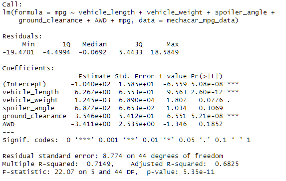
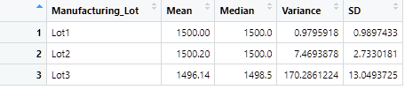
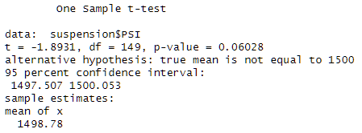
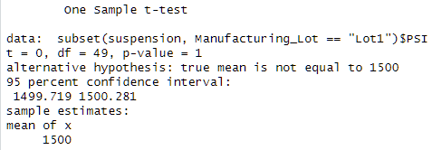
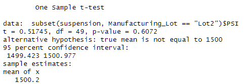
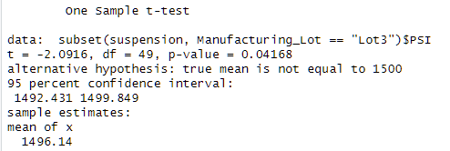

# MechaCar_Statistical_Analysis

## Overview
Statisitical analysis of MechaCar automobile performance

### Goals
Part 1: Linear Regression to Predict MPG
Part 2: Summary Statistics on Suspension Coils
Part 3: T-Test on Suspension Coils
Part 4: Design a Study Comparing the MechaCar to the Competition

## Resources
- Software: R, RStudio

## Analysis
### Linear Regression to Predict MPG

We performed a linear regression analysis to predict the mpg of MechaCar prototypes based on six variables. The variables that provided a non-random amount of variance to the mpg values were vehicle weight, spoiler angle, and AWD. The slope of the linear model was not considered to be zero, and the coefficients for these variables were not equal to zero. However, the model only explained about 71% of the variance in the data, suggesting that other variables may be needed for more accurate predictions.

### Summary Statistics on Suspension Coils

The overall manufacturing process for the suspension coils meets the design specification for variance, with a variance of 62.2936 PSI. However, Lot 3 has a higher variance of 170 PSI, which exceeds the design specification. Therefore, while the manufacturing process as a whole is within specification, Lot 3 needs further investigation to address the inconsistency in weight capacity.

### T-Tests on Suspension Coils

The two-sample t-test conducted using the t.test() function in R showed that there was no statistical difference between the PSI of all manufacturing lots and the population mean of 1,500 PSI. The p-value of 0.06 was greater than the significance level of 0.05, leading to the acceptance of the null hypothesis.

Using the subset() argument in the t.test() function, we performed individual t-tests on each manufacturing lot to compare their PSI to the population mean of 1,500 PSI. Results showed that Lot 1 had no statistical difference, Lot 2 had no significant difference, and Lot 3 had a significant difference in PSI compared to the population mean. Lot 3 data may need to be revaluated or discarded due to its p-value being too low.

### Study Design: MechaCar vs Competition

